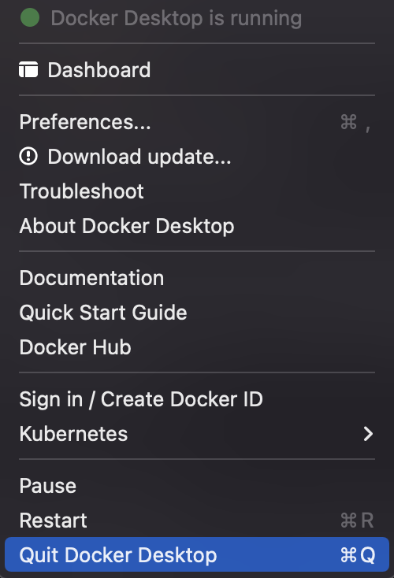

# circles-server-node [](https://github.com/probrainteam/circles-server-node/actions/workflows/push.yml) [](https://github.com/probrainteam/circles-server-node/actions/workflows/pull-request.yml)

   

| <a id="a1"></a>목차          |
| --------------------------- |
| [1. 프로젝트 개요](#1)<br/>    |
| [2. Development setting ](#2)<br/>       |
| [3. Trouble shooting ](#3)<br/>       |


<br/>

# <a id="1"></a>[1](#a1). 프로젝트 개요

# <a id="2"></a>[2](#a1). Development setting
## 필요사항
- yarn :: v1.22.17
- docker :: v20.10.12, build e91ed57
- vscode
  - [eslint :: v2.2.2](https://marketplace.visualstudio.com/items?itemName=dbaeumer.vscode-eslint)
  - [prettier :: v9.3.0](https://marketplace.visualstudio.com/items?itemName=esbenp.prettier-vscode)
  - [NGINX Confituation :: v0.7.2](https://marketplace.visualstudio.com/items?itemName=william-voyek.vscode-nginx)

## 세팅 방법
- Mac/linux/Windows

  👉 with docker
    - `yarn dev`
 
# <a id="3"></a>[3](#a1). Trouble shooting
## Docker
docker container 내부 로그에서 inode 저장공간 관련 오류가 나는 경우 아래 명령어를 차래로 입력하여 강제로 저장공간을 확보합니다.
- 이 때 docker container를 모두 삭제한 후 진행합니다.

  
``` shell
docker system prune
```
``` shell
docker volume prune
```
이 후 아래 명령어를 통해 정상적으로 삭제 되었는지 확인합니다.
``` shell
docker volume ls
```
``` shell
docker system df
``` 
- :bug: docker가 뻗은 경우 Quit Docker Desktop을 통해 docker를 강제 종료합니다.

  
## NGINX 502
🌋 Node docker가 준비되지 않은 경우 NGINX 502가 발생합니다.
- 일정 시간 이 후 재시도하면 됩니다.
- Error page 제작 또는 docker depends on 설정을 통해 fix 예정
